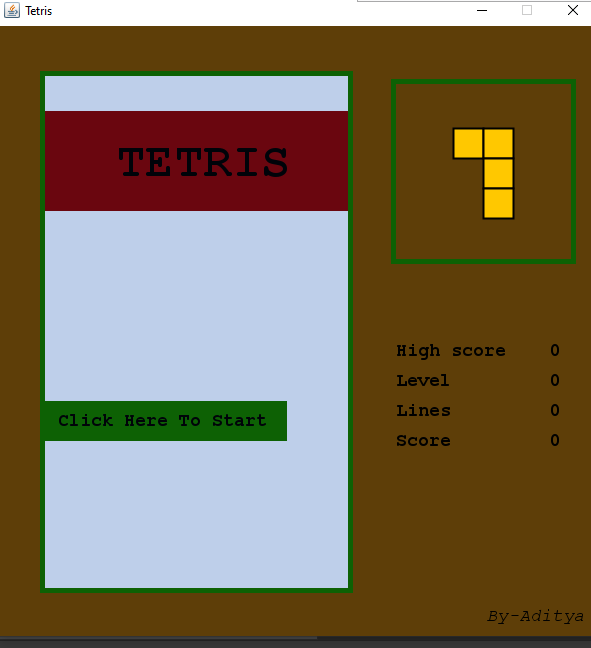
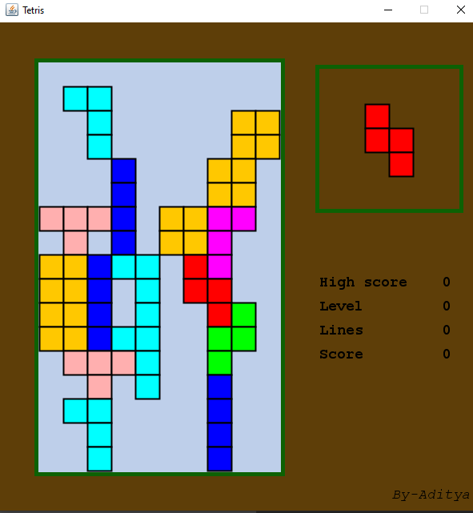

# TETRIS
A Classic Oldschool Game for Game lovers

# How to build it ?
Using Java JDK 8+

#Packages used-:  
 java awt,
 java lang,
 java util,
 javax swing.

# How to play ?

    Mouse Click - Start a new game

    LEFT - Move the current shape to the left

    RIGHT - Move the current shape to the right

    UP - Rotate the current shape

    DOWN - "Hard drop" current shape

# Score criteria
When a horizonatal line in the playing space is completly filled with the pieces then-  
Score point will be increased by 10 and one line will be decreased in the playing area and this continues until Line score reach 10.

After that 1 Level will be increased.

